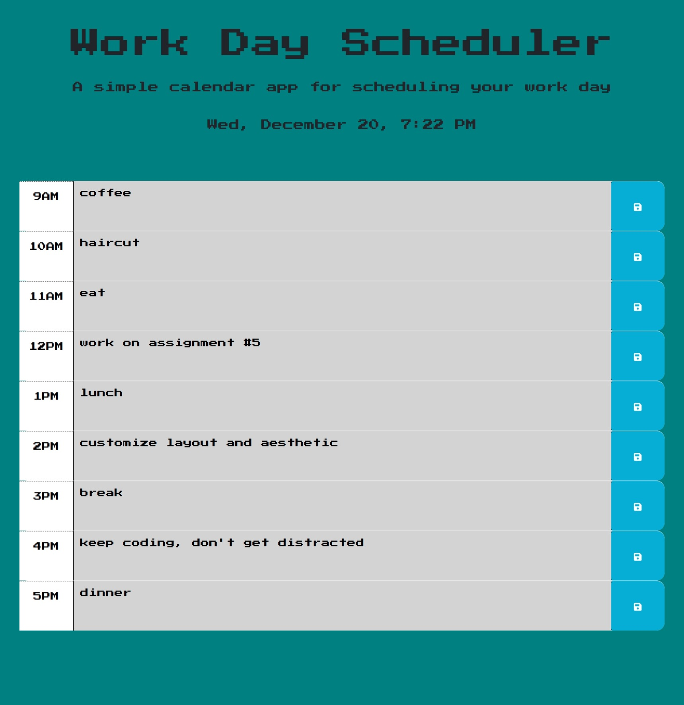

# Work Day Scheduler

### A simple retro-style calendar app for scheduling your work day 🗓️

## Overview

The Work Day Scheduler is a web-based calendar application that allows users to plan and organize their work day. With a retro-inspired design and user-friendly interface, it provides a straightforward way to manage tasks and appointments for the day.

## Features

- Retro-inspired design with a classic dark teal background reminiscent of the Game Boy Color.
- Time-blocks for each hour of the work day.
- Dynamic styling to indicate past, present, and future hours.
- Ability to add and save tasks for each hour.
- Tasks are stored locally and persist even after page refresh.

## Usage

- **Try it out:** [Work Day Scheduler](https://robertsolorzano.github.io/Work-Day-Scheduler/)

### Technologies

- HTML
- CSS (including Bootstrap for layout)
- JavaScript (including jQuery for DOM manipulation)
- [Day.js](https://day.js.org/) for date and time handling
- [Google Fonts](https://fonts.google.com/) for font selection

## Installation

1. Clone the repository to your local machine.
2. Open the project folder in your preferred code editor.

## How to Use

1. Open the `index.html` file in your web browser.
2. The current date and time will be displayed at the top of the page.
3. Each hour of the work day is represented as a time block.
4. To add a task for a specific hour:
   - Click inside the text area for that hour.
   - Enter your task.
   - Click the save button to store your task.
5. Your tasks are saved locally and will be displayed even after refreshing the page.
6. Time blocks are color-coded:
   - Past hours are grayed out.
   - The current hour is highlighted in red.
   - Future hours are highlighted in green.

## License

This project is licensed under the MIT License. See the [LICENSE](LICENSE) file for details.

## Credits

### Source Code for Project Assignment

- Source code for project assignment: [crispy-octo-meme](https://github.com/coding-boot-camp/crispy-octo-meme)

### Libraries and Frameworks

- [Day.js](https://day.js.org/): Used for handling date and time operations.
- [Bootstrap](https://getbootstrap.com/): Used for building the user interface.
- [jQuery](https://jquery.com/): Used for simplifying DOM manipulation and event handling.

